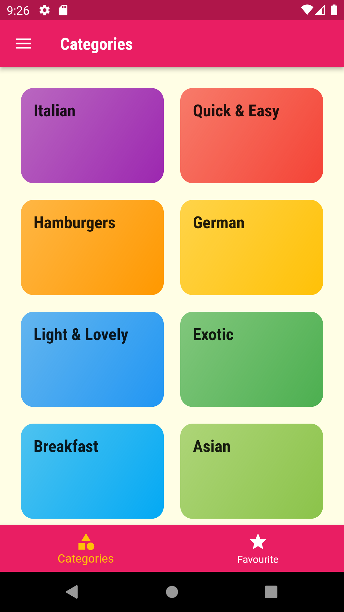
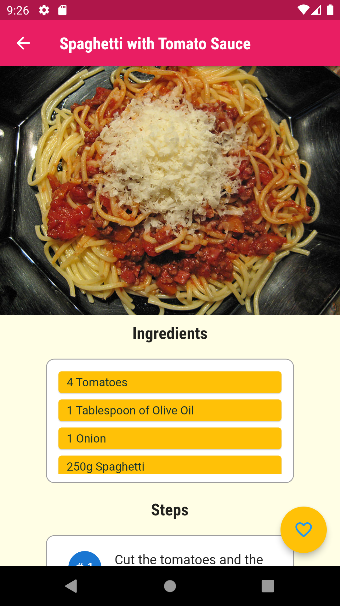
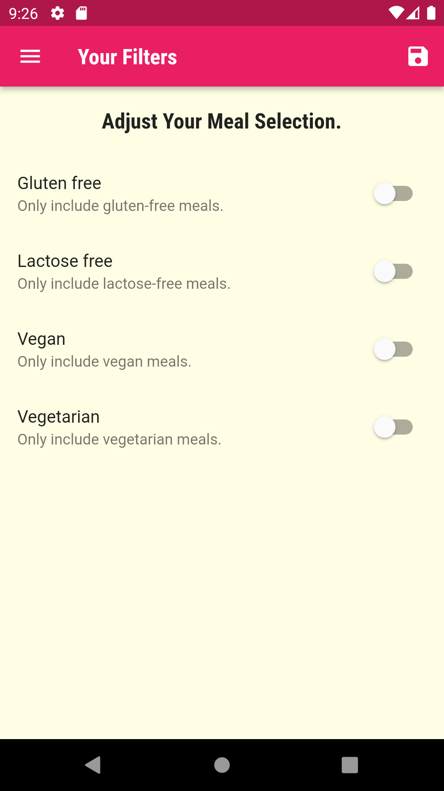

# Flutter Meal App Version 1

Welcome to the Flutter Meal App! This is a mobile application designed to help you explore various meal categories, manage your favorites, apply filters, and even access detailed recipes with step-by-step instructions. Whether you're a cooking enthusiast or just looking for meal inspiration, this app has got you covered.

## Features

### 1. Meal Categories

Discover a wide range of meal categories, from breakfast to dessert! Browse through appetizers, main courses, sides, and more. Each category offers a curated selection of delicious meals to choose from.

### 2. Favorites

Found a meal you love? Mark it as a favorite for quick access later. The Favorites screen lets you view all your preferred meals in one place.

### 3. Filters

Customize your meal exploration with handy filters. Narrow down your search based on dietary preferences, cooking time, and ingredients available. This feature ensures you find meals tailored to your specific needs.

### 4. Recipe Details

Want to try cooking a meal? The app provides comprehensive recipe details, including ingredients, step-by-step instructions, and images. Never miss a beat while preparing your favorite dishes.

## Screenshots

Here are some screenshots from the app:






## Getting Started

To run the Flutter Meal App on your local machine, follow these steps:

1. **Prerequisites:** Make sure you have Flutter and Dart installed on your system. If not, you can [install Flutter](https://flutter.dev/docs/get-started/install) and set up your development environment.

2. **Clone the Repository:** Clone this GitHub repository to your preferred location using the following command:

   ```bash
   git clone https://github.com/yourusername/flutter-meal-app.git
   ```

3. **Navigate to the Project:** Move into the project directory:

   ```bash
   cd flutter-meal-app
   ```

4. **Install Dependencies:** Fetch the required dependencies by running:

   ```bash
   flutter pub get
   ```

5. **Run the App:** Launch the app on an emulator or a connected device:

   ```bash
   flutter run
   ```
## Feedback and Support

If you encounter any issues while using the app or have suggestions for improvements, please feel free to [open an issue](https://github.com/yourusername/flutter-meal-app/issues). We value your feedback and are committed to making this app better with your input.

---

Happy cooking with the Flutter Meal App! Bon appétit! 🍽️
